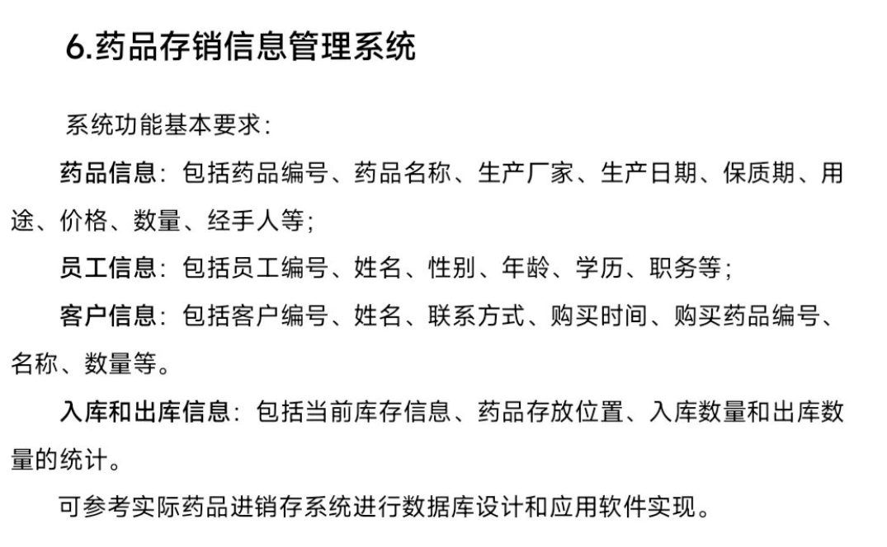

# 药品存销信息管理系统

## 项目介绍

药品存销信息管理系统（Drug Inventory Management System）是一个基于Spring Boot开发的药品库存管理应用程序。该系统旨在帮助药店、医院或药品仓库高效地管理药品的入库、出库、库存查询等业务流程，提高药品管理的效率和准确性。

## 技术栈

- **后端框架**：Spring Boot
- **ORM框架**：MyBatis-Plus 3.5.1
- **数据库**：MySQL
- **项目管理工具**：Maven
- **其他工具库**：
  - Lombok：简化Java代码
  - FastJSON：JSON处理
  - SLF4J：日志处理

## 功能特性

系统主要包含以下功能模块：

### 1. 药品信息管理
- 药品信息的添加、删除、修改和查询
- 根据药品名称搜索药品
- 药品基本信息维护（名称、生产厂家、生产日期、保质期、用途、价格等）

### 2. 员工信息管理
- 员工信息的维护和管理
- 员工权限控制

### 3. 客户信息管理
- 客户基本信息的维护
- 客户购药记录查询

### 4. 入库信息管理
- 药品入库记录
- 入库统计和分析

### 5. 出库信息管理
- 药品出库记录
- 出库统计和分析

## 系统架构

项目采用典型的三层架构：

- **表示层（Controller）**：处理HTTP请求，返回响应
- **业务逻辑层（Service）**：实现业务逻辑
- **数据访问层（Mapper）**：与数据库交互

## 数据模型

系统主要包含以下实体：

- **Drug**：药品信息
- **Employee**：员工信息
- **CustomerInformation**：客户信息
- **IncomingInformation**：入库信息
- **OutgoingInformation**：出库信息

## 安装与部署

### 环境要求

- JDK 11+
- Maven 3.6+
- MySQL 5.7+

### 安装步骤

1. 克隆项目到本地

```bash
git clone [项目仓库URL]
cd dbcd
```

2. 配置数据库

在MySQL中创建名为`druginventorymanagement`的数据库，然后根据需要修改`src/main/resources/application.yml`中的数据库连接信息：

```yaml
spring:
  datasource:
    driver-class-name: com.mysql.cj.jdbc.Driver
    url: jdbc:mysql://localhost:3306/druginventorymanagement?useUnicode=true&characterEncoding=utf8&useSSL=false
    username: root
    password: 你的密码
```


